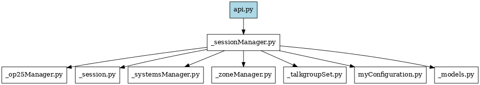

# Core Modules for OP25 Headunit

## Dependant Module Overview

- **linuxSystem/**
  Modules that support system-level functionality and process management.
  
- **__init__.py**  
  Declares this folder as a Python package.

- **_models.py**  
  Temporary import manager for other modules. Will be renamed appropriately in a future release.

- **_op25Manager.py**  
  Handles execution and management of the `rx.py` process. Starts, stops, and monitors the OP25 scanner runtime.

- **_session.py**  
  Manages the user session instance tied to the current frontend client connection.

- **_sessionManager.py**  
  Provides top-level access to key system managers such as:
  - `zoneManager`
  - `talkgroupsManager`
  - `systemsManager`
  - `op25Manager`
  - Also imports and references `api.py` to coordinate interactions

- **_systemsManager.py**  
  Reads, writes, and manages the `../systems.json` file, which contains trunking system definitions.

- **_talkgroupSet.py**  
  Loads and manages `../talkgroups.json`, providing structured access to TGID configuration.
  
- **_zoneManager.py**  
  Interfaces with `../zones.json`, handling zone and channel group definitions.

- **myConfiguration.py**  
  Contains functions to read and write values from `../config.ini`.

## Independant Module Overview
- **_remote.py.py**  
  Contains the python script, which can be run as a service to monitor and direct HID-support wireless remotes. See [readme_remote.md](readme_remote.md) for more information.
