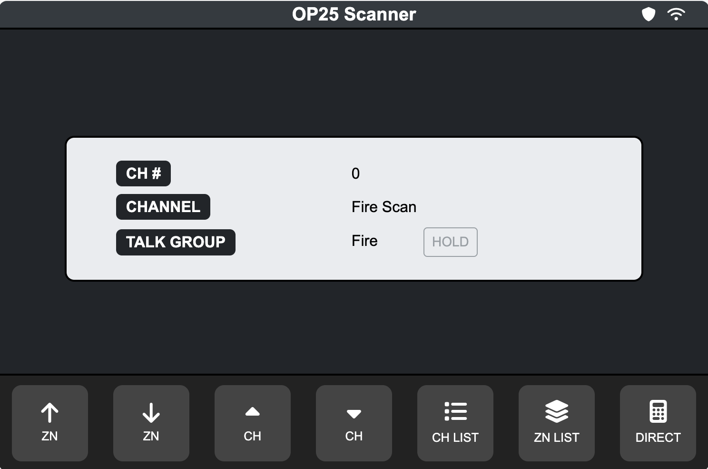

# OP25 Vehicle Scanner GUI

<p> </p>

## Overview
This project provides a graphical user interface (GUI) for OP25, a software-defined radio (SDR) scanner running on a Raspberry Pi. It integrates OP25 with a touchscreen interface to simplify scanning and monitoring talkgroups in a vehicle at low cost.

## User Interface
The project serves the `/html` folder for the UI and uses `api.py` to handle interaction between the webpage and OP25. This setup uses fewer resources and allows layout flexibility based on screen size.

## Features
- **Graphical Interface**: HTML-based UI for controlling OP25
- **Talkgroup Management**: Supports whitelist, blacklist, and dynamic selection
- **Scan Mode**: Reloads OP25’s whitelist dynamically
- **System Integration**: Currently supports one system; future updates will address multi-system support
- 

## Features Coming Soon
- **OP25 Parameter Adjustments**: Values set in config.ini will be passed to the software. Currently, parameters are hardcoded in the Python script.
- **Advanced Keypad Entry**: Enter a known TAC or OPS channel directly using the corresponding button.
- **Active Voice Calls**: View the active talkgroup name or number (if not defined).
- **Direct Programming**: Web-based utilities will handle software configuration directly, eliminating the need to manually copy configuration files.

## Requirements

### Hardware
- Raspberry Pi 4 
- RTL-SDR USB dongle 
- Touchscreen display 
- **MicroSD Card**: Use a new card to avoid data loss. Install Ubuntu Server on its own MicroSD card. This script is in beta and may not be fully stable.

### Pi 5 Compatibility
- The Raspberry Pi 5 ran more reliably with increased memory. However, OP25 had trouble outputting audio through an AUX-to-USB adapter. A future update will allow selection of the default playback device. The OP25 back-end is still temperamental, and since it is not my script, solutions to common issues are limited and poorly documented online.

### Software
- **Operating System**: Ubuntu Server (recommended for OP25 compatibility).
- **PI OS** The OP25 struggles with Pi OS and is not reccomdended. 
- **Dependencies**:  
  - `OP25` (installed at `/home/(user)/op25`)    
  - `pyttsx3` for text-to-speech (upcoming feature)  
  - `firefox-esr` for interface display
  - `flash` for serving API and webpages
  - `openbox` for Firefox's GUI

### Notes for Ubuntu Server Users
- Ubuntu Server lacks a graphical interface by default and you must install these apps:

```bash
sudo apt install openbox firefox-esr xinit x11-xserver-utils
```

## Tested Hardware
- Raspberry Pi 4 with Ubuntu Server installed  
- Freenove 5" Touchscreen Monitor (800x480)  
- RTL-SDR Blog V4 R828D RTL2832U 1PPM TCXO SMA SDR  

## Installation
See the installation wizard at [/html/utilities/install-wizard.html](https://github.com/TheMrNaab/op25-headunit/blob/6022ac7fdb9acd2600f27025fefb03b12a39c06e/html/utilities/install-wizard.html).
