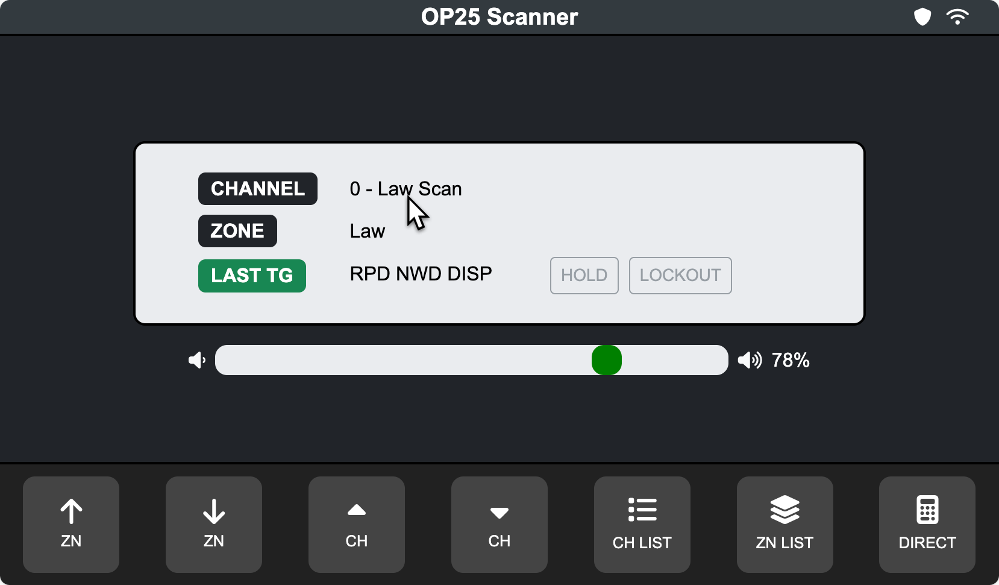
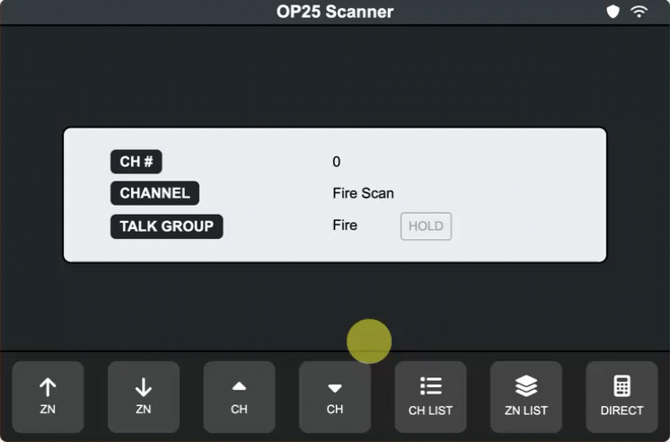

# OP25 Vehicle Scanner GUI

 

## Overview
This project provides a graphical user interface (GUI) for OP25, a software-defined radio (SDR) scanner running on a Raspberry Pi. It integrates OP25 with a touchscreen interface to simplify scanning and monitoring talkgroups in a vehicle at low cost.

## User Interface
The project serves the `/html` folder for the UI and uses `api.py` to handle interaction between the webpage and OP25. This setup uses fewer resources and allows layout flexibility based on screen size.

## Features
- **Graphical Interface**: HTML-based UI for controlling OP25
- **Talkgroup Management**: Supports whitelist, blacklist, and dynamic selection
- **Scan Mode**: Reloads OP25’s whitelist dynamically
- **System Integration**: Currently supports one system; future updates will address multi-system support
- **Active Voice Calls**: View the active talkgroup name or number (if not defined).
- **Volume Adjustment** Allows you to control the output volume on the home screen. 

### Known Issues
- **Default Zone/Channel**: On page load (or reload), the app restores the last‑used zone and channel behind the scenes. However, the on‑screen display won’t update automatically—you’ll need to reselect the channel to see the restored setting. This is on my priority list to fix.
- **Auto Screen Off**: The display powers off after 5 minutes of inactivity.
- **Singular P25 System Support**: A future release will allow use of channels from multiple P25 systems simultaneously.
-	**Utilities**: The utilities folder contains web pages that generate configuration files. This process will be simplified in an upcoming update.
- **BoatBod’s OP25**: OP25 is the backend software powering this head unit. It must be built (and rebuilt when dependencies change). This isn’t my script—it’s the only available solution for this hardware—so please follow the build instructions exactly.
**Audio Output**: Audio defaults to your system’s primary output (AUX on a Pi 4; HDMI on a Pi 5). An option to select a different audio device will be added later this week.

### Features Coming Soon
- **OP25 Parameter Adjustments**: Values set in config.ini will be passed to the software. Currently, parameters are hardcoded in the Python script.
- **Advanced Keypad Entry**: Enter a known TAC or OPS channel directly using the corresponding button.
- **Direct Programming**: Web-based utilities will handle software configuration directly, eliminating the need to manually copy configuration files.

## Requirements

### Hardware
- Raspberry Pi 4 
- RTL-SDR USB dongle 
- Touchscreen display (or any monitor with a mouse)
- **MicroSD Card**: Use a new card to avoid data loss. Install Ubuntu Server on its own MicroSD card. This script is in beta and may not be fully stable.

### Pi 5 Compatibility
- The Raspberry Pi 5 ran more reliably with increased memory. However, OP25 had trouble outputting audio through an AUX-to-USB adapter. A future update will allow selection of the default playback device. The OP25 back-end is still temperamental, and since it is not my script, solutions to common issues are limited and poorly documented online.

## Installation
Download and click through the installation wizard at [/html/utilities/install-wizard.html](https://github.com/TheMrNaab/op25-headunit/blob/6022ac7fdb9acd2600f27025fefb03b12a39c06e/html/utilities/install-wizard.html). 

### Software
- **Operating System**: Ubuntu Server (recommended for OP25 compatibility).
- **PI OS** The OP25 struggles with Pi OS and is not reccomdended.
- **Tested On** ### Raspberry Pi 4 with Ubuntu Server installed, Freenove 5" Touchscreen Monitor (800x480) and RTL-SDR Blog V4 RTL2832U SDR
- **Dependencies**:  
  - `OP25` (installed at `/home/(user)/op25`)    
  - `pyttsx3` for text-to-speech (upcoming feature)  
  - `firefox-esr` for interface display
  - `flash` for serving API and webpages
  - `openbox` for Firefox's GUI

### Notes for Ubuntu Server Users
- Ubuntu Server lacks a graphical interface by default and you must a GUI app to run this app.
- This is covered in the installation wizard.

